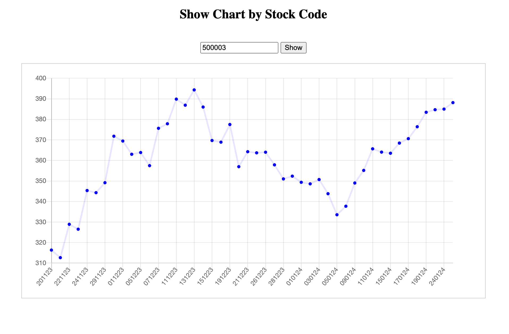

# BSE Stock Viewer (Python & MongoDB)

## Version Details

- Python 3.11.7
- MongoDB 7.0.2
- cURL 8.4.0

## Setup & Run

### 1. Clone the repository

```bash
git clone https://github.com/<username>/stock-price-view.git
```

### 2. Initialize Python Virtual Environment

Make sure Python virtual environment ([virtualenv](https://pypi.org/project/virtualenv/)) is installed.

```bash
python -m venv env
```

### 3. Activate the virtual environment

```bash
source env/bin/activate
```

### 4. Install the dependencies

```bash
pip install -r requirements.txt
```

### 5. Run the application

```bash
python app.py
```

## API Endpoints

### 1. Get Top _**k**_ Stocks

Top stocks are the stocks with highest growth rate considering the oldest date in the database as the base date.

```bash
curl -X GET http://localhost:8000/get_top_k/<k>
```

### 2. Search Stock by Name

It searches for the stock by name and returns the stock with _**stock code**_, _**stock name**_, _**pnl**_ & other details.

```bash
curl -X GET http://localhost:8000/search/<name>
```

### 3. Get Favorite Stocks

```bash
curl -X GET http://localhost:8000/get_favorites
```

### 4. Add Stock to Favorites

```bash
curl -X POST http://localhost:8000/add_favorite/<stock_code>
```

### 5. Remove Stock from Favorites

```bash
curl -X DELETE http://localhost:8000/remove_favorite/<stock_code>
```

### 6. Get Stock Price History

It returns the price history of the stock in the database. It returns a json object with two keys: _**days**_ & _**prices**_, where _days_ is a list of dates in _**ddmmyy**_ format in sorted order and _**prices**_ is a list of prices corresponding to the dates in _**days**_.

```bash
curl -X GET http://localhost:8000/get_price_history/<stock_code>
```

## Chart UI

See the **Chart UI** at

```url
http://localhost:8001/chart.html
```



Here you can see the price chart by putting the stock code in the input field.

## Other Details

- The app runs the _**preset**_ script and then start _**API**_.
- It download and stores past 50 days data (excluding weekends) of all the stocks in the database for the first time only, later it only updates the database with the latest data.
- The DB can be refreshed by changing the _**refresh**_ variable in _**app.py**_ (line no. **42**) to _**True**_.

    ```python
    if __name__ == "__main__":
        preset(days=50, refresh=True)
    ```
